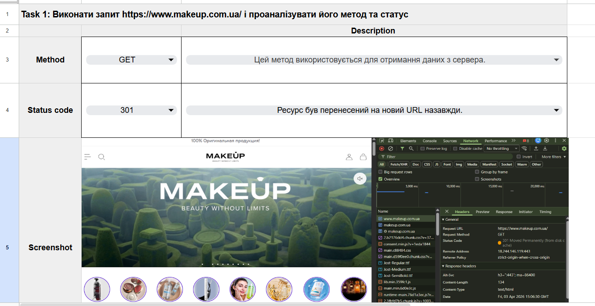
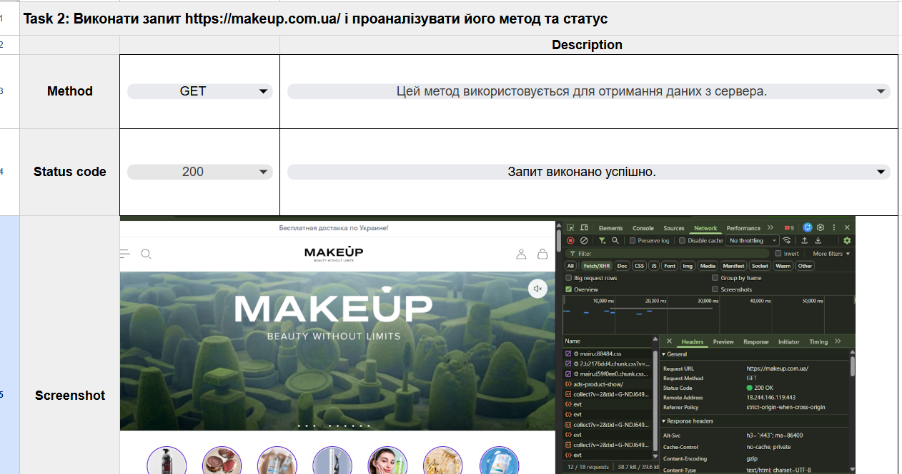
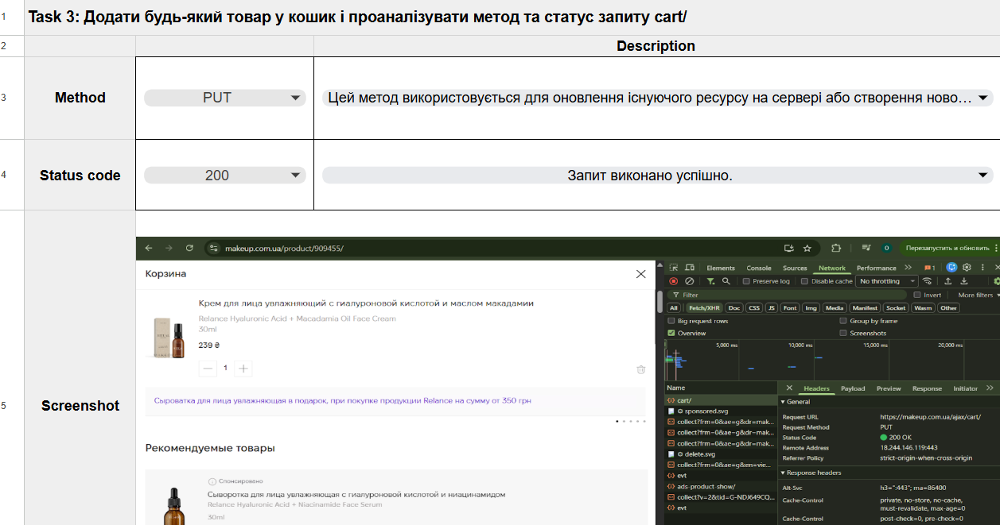
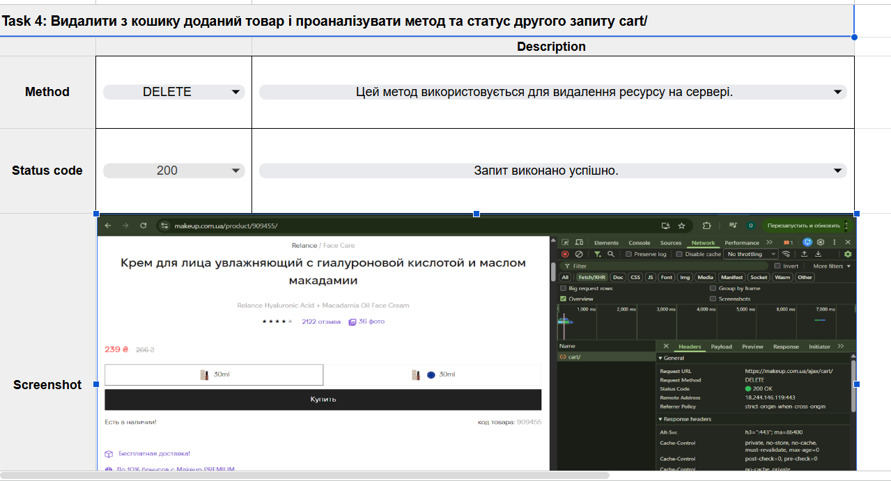
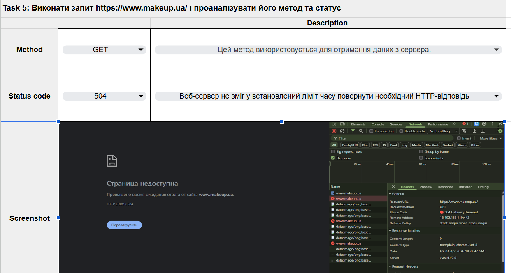
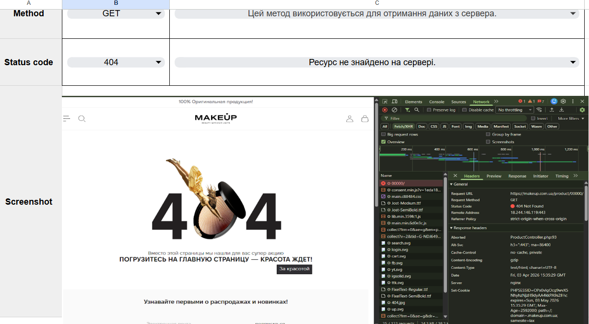
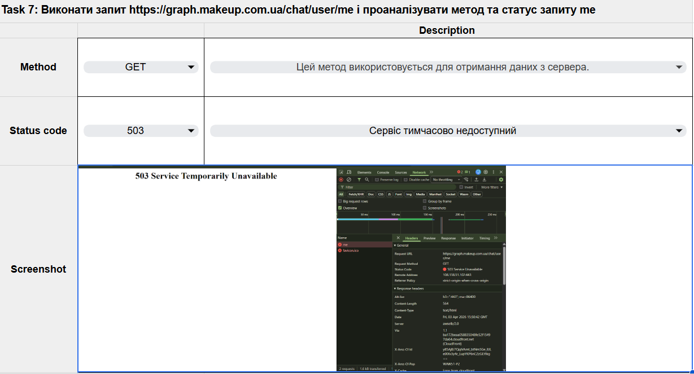

# API Testing (Ukrainian)

## API 01. GET Request Analysis (301 Moved Permanently)

## API 02. GET Request Analysis (200 OK)

## API 03. Add Product to Cart (PUT, 200 OK)

## API 04. Remove Product from Cart (DELETE, 200 OK)

## API 05. Error Response Analysis (504 Gateway Timeout)

## API 06. Error Response Analysis (404 Not Found)

## API 07. Error Response Analysis (503 Service Unavailable)

