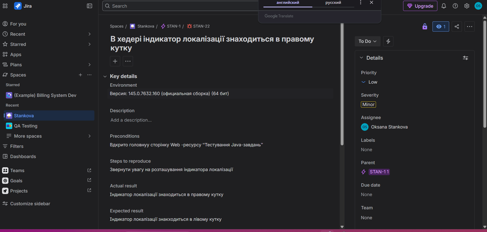
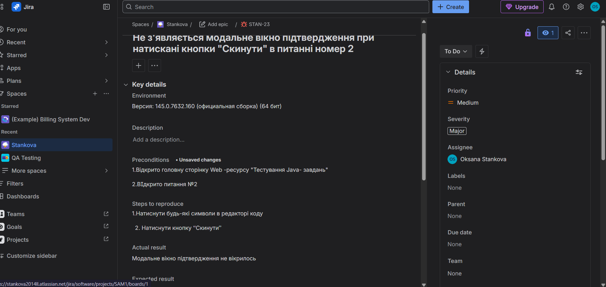
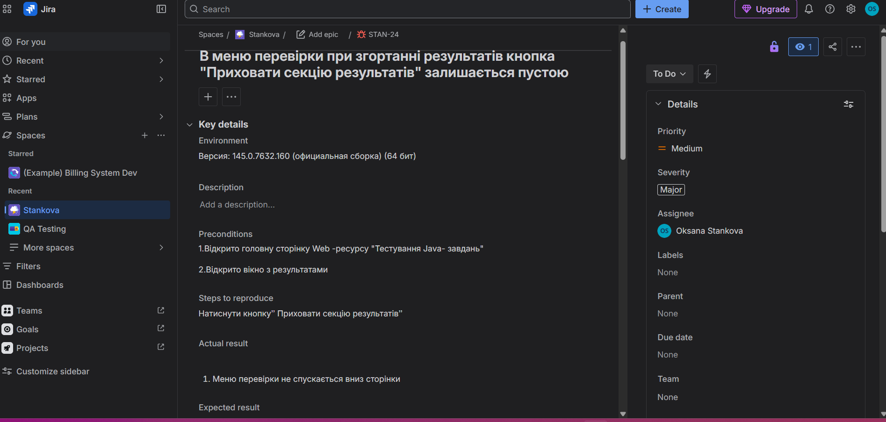
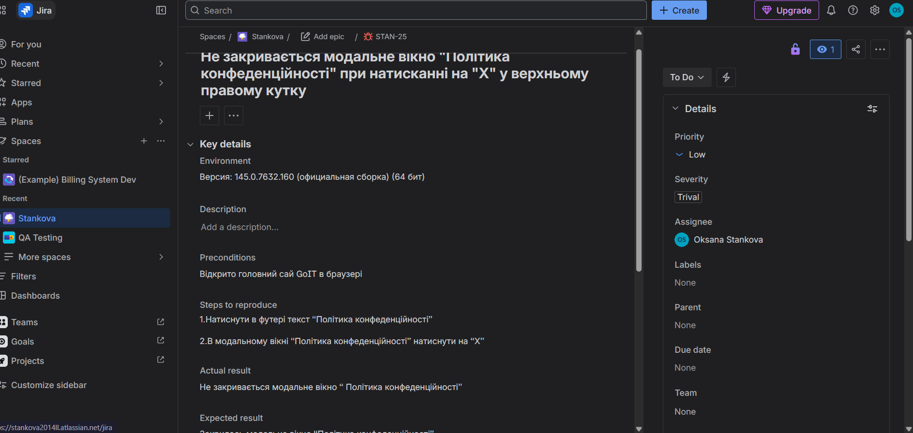
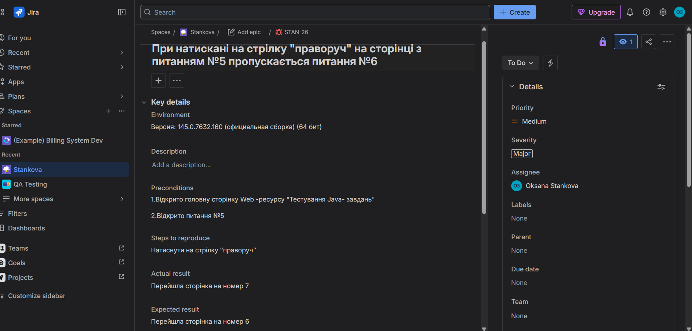

# Jira Defect Reports
# Jira Bug Reports

This section contains bug reports created and tracked in Jira.

The defects were documented with detailed descriptions, severity assessment, expected results, actual results and supporting evidence.

## Tools Used

* Jira
* Bug Reporting
* Defect Tracking
* QA Documentation

---

## Bug 1. Localization Indicator Position

Issue ID: STAN-22

The localization indicator is displayed in the wrong position on the page.

---

## Bug 2. Confirmation Modal Not Displayed

Issue ID: STAN-23

The confirmation modal window does not appear after clicking the required button.

---

## Bug 3. Hide Section Button Issue

Issue ID: STAN-24

The hide section functionality works incorrectly when results are collapsed.

---

## Bug 4. Privacy Policy Modal Cannot Be Closed

Issue ID: STAN-25

The Privacy Policy modal window remains open and cannot be closed.

---

## Bug 5. Question Navigation Issue

Issue ID: STAN-26

Navigation skips content when moving through questions.

---

## Skills Demonstrated

* Bug Reporting
* Defect Lifecycle
* Jira
* Functional Testing
* UI Testing
* Documentation
