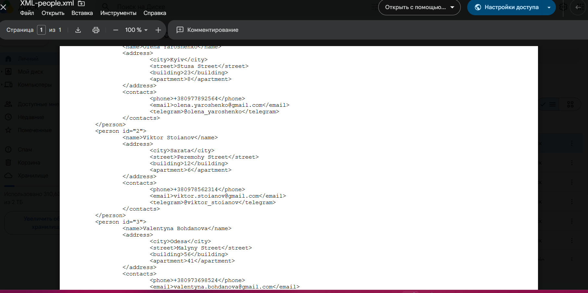
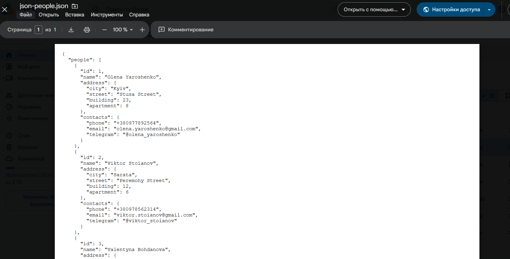

# XML and JSON Data Structures

This section demonstrates basic understanding of XML and JSON data formats used in API testing and data exchange.

The same people dataset was represented in two formats to compare structure, readability and syntax.

## Covered Topics

* XML structure
* JSON structure
* Nested data
* Objects and arrays
* Key value pairs
* Data format comparison

---## XML Structure

XML uses nested tags to store structured data.

## JSON Structure

JSON stores data using objects, arrays and key value pairs.

## XML vs JSON

| XML | JSON |
|------|------|
| Uses tags | Uses key value pairs |
| More verbose | More compact |
| Supports attributes | Uses object properties |
| Common in enterprise systems | Common in REST APIs |

## Skills Demonstrated

* XML
* JSON
* Data Structures
* API Data Formats
