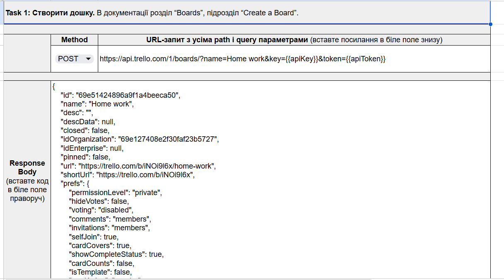
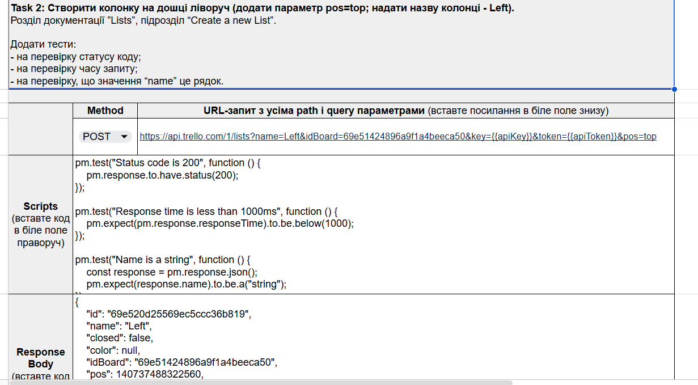
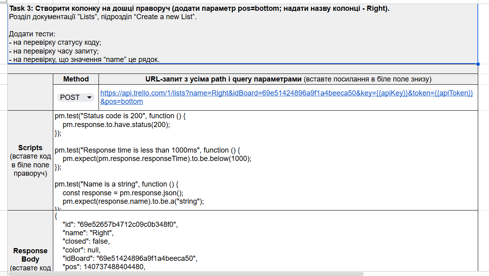
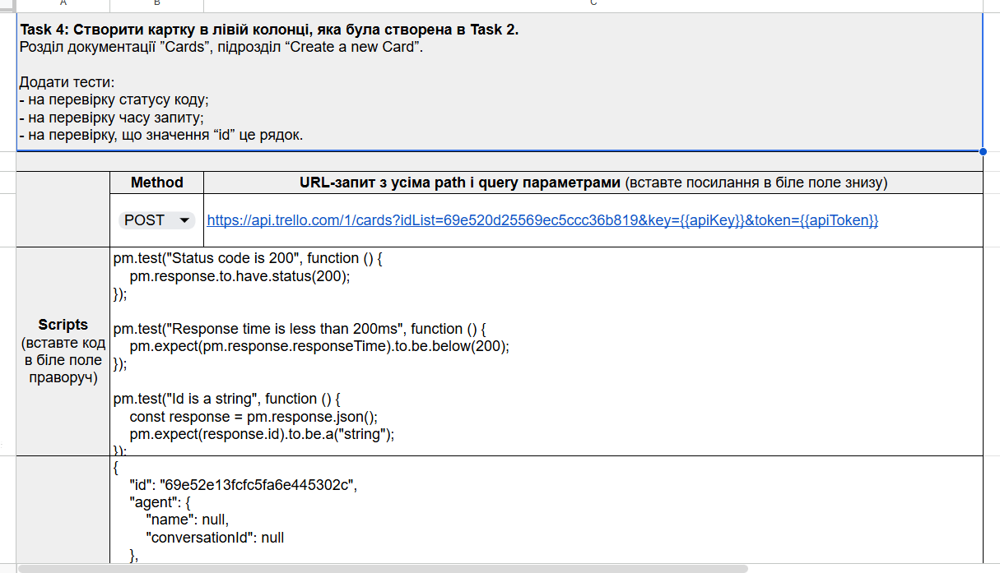
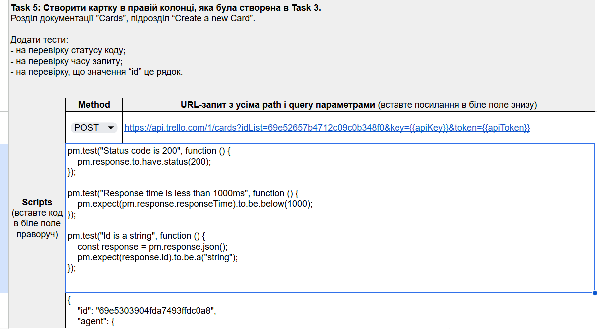
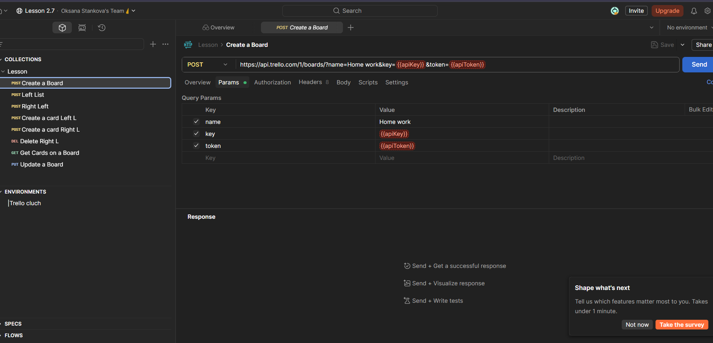

# Trello API Testing with Postman

## Project Overview

This project demonstrates API testing of the Trello REST API using Postman.

The workflow covers the complete lifecycle of board management:

- Create a board
- Create lists
- Create cards
- Delete a card
- Retrieve board cards
- Update board information

The project includes:
- Request validation
- Status code verification
- Response time checks
- Response body validation
- Postman test scripts

## Tools Used

- Postman
- Trello REST API
- JSON
- JavaScript Assertions

---

## API Requests Overview

## API Requests Overview

### API 01. Create Board

Method: POST

Endpoint: `/1/boards`

Validation:
- Board created successfully
- Response body returned

---

### API 02. Create Left List

Method: POST

Endpoint: `/1/lists`

Validation:
- Status code = 200
- Response time < 1000 ms
- Name field is string

---

### API 03. Create Right List

Method: POST

Endpoint: `/1/lists`

Validation:
- Status code = 200
- Response time < 1000 ms
- Name field is string

---

### API 04. Create Left Card

Method: POST

Endpoint: `/1/cards`

Validation:
- Status code = 200
- Response time < 1000 ms
- ID field is string

---

### API 05. Create Right Card

Method: POST

Endpoint: `/1/cards`

Validation:
- Status code = 200
- Response time < 1000 ms
- ID field is string

---

### API 06. Delete Card

Method: DELETE

Endpoint: `/1/cards/{cardId}`

Validation:
- Status code = 200
- Card deleted successfully

---

### API 07. Get Cards on Board

Method: GET

Endpoint: `/1/boards/{boardId}/cards`

Validation:
- Status code = 200
- Response is array
- Response time < 1000 ms

---

### API 08. Update Board

Method: PUT

Endpoint: `/1/boards/{boardId}`

Validation:
- Status code = 200
- Board updated successfully
- Response time < 1200 ms

---

## Postman Collection Structure

