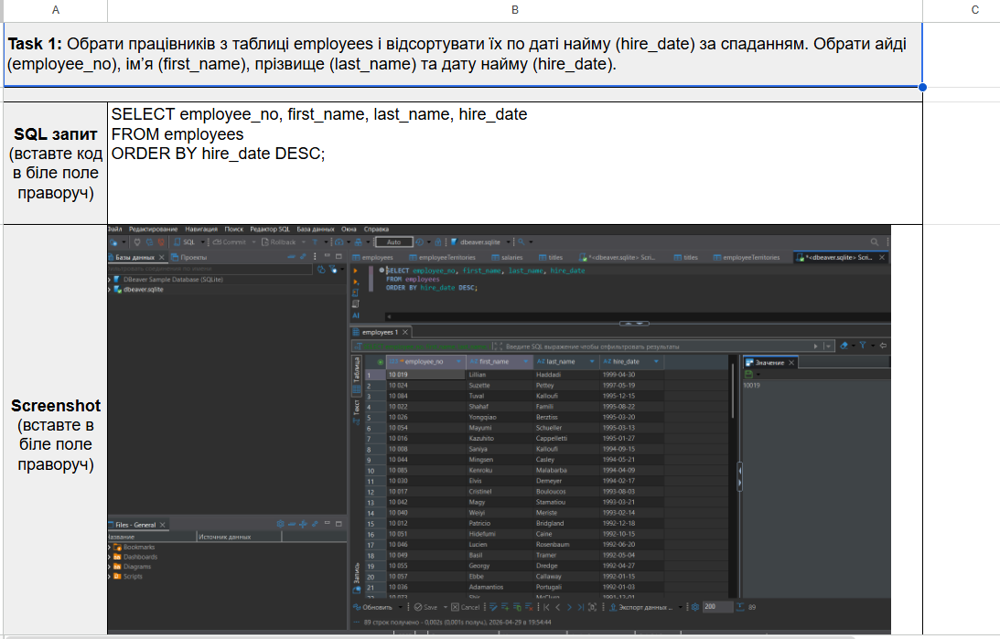
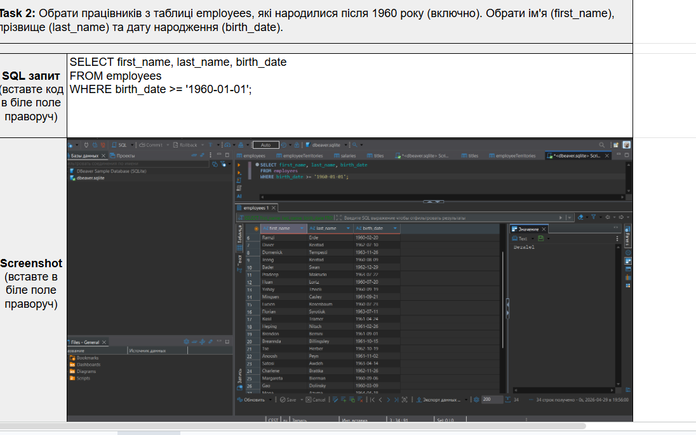
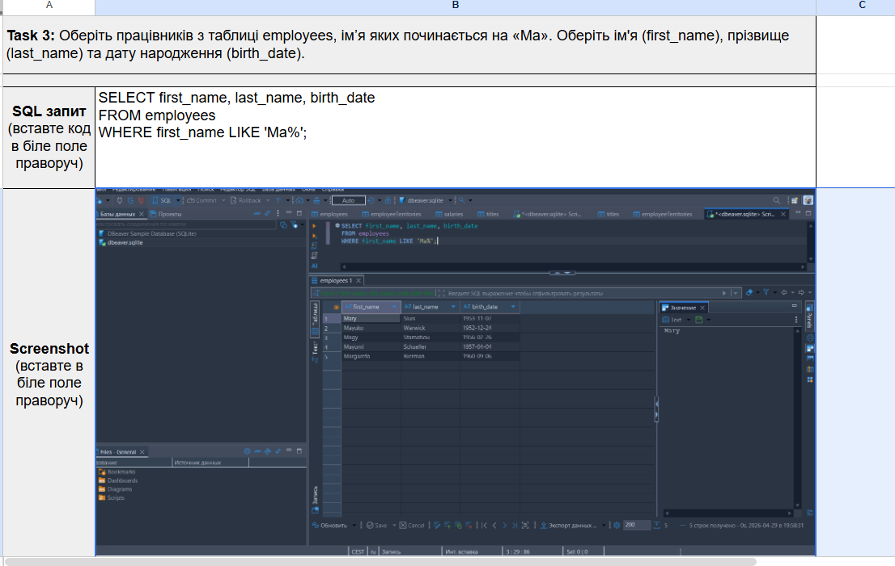
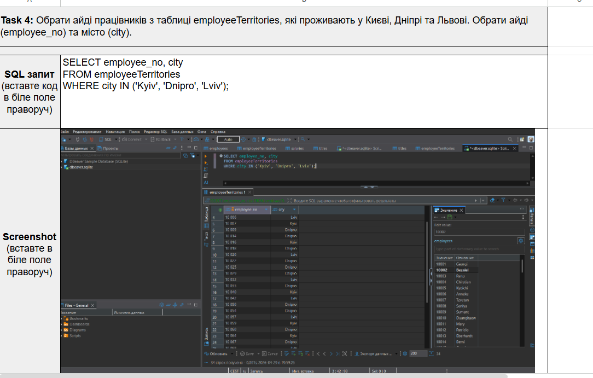
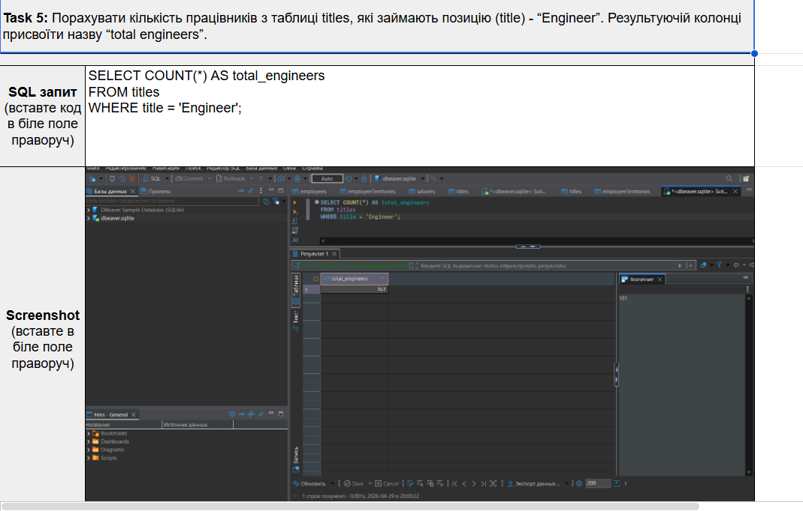
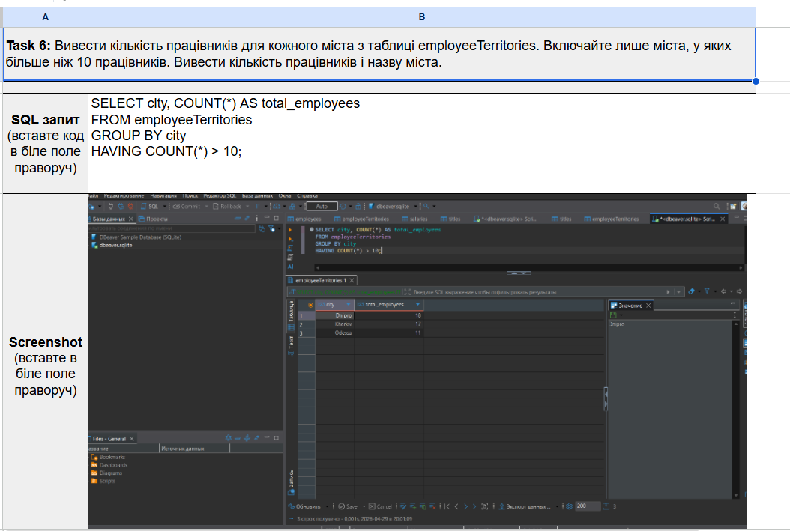
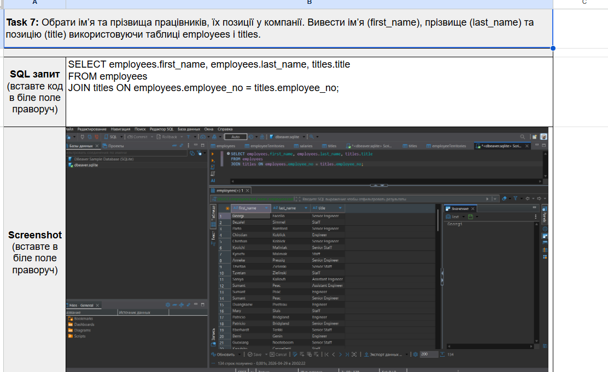
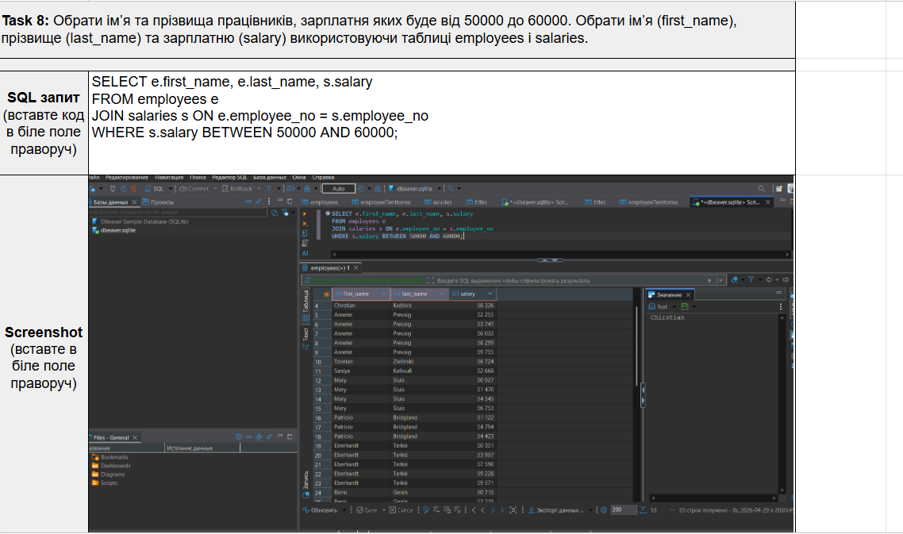

# SQL Queries Practice

SQL practice tasks performed on an employees database using DBeaver.

Covered topics:

* SELECT queries
* Filtering with WHERE
* Sorting with ORDER BY
* Pattern matching with LIKE
* Filtering with IN
* Aggregation with COUNT
* Grouping with GROUP BY and HAVING
* JOIN queries
* Filtering with BETWEEN
# SQL Queries Practice
## Task 1. Order Employees by Hire Date

Retrieved employee ID, first name, last name and hire date.
Results were sorted by hire date in descending order using ORDER BY.

**Skills:** SELECT, ORDER BY

## Task 2. Employees Born After 1960

Selected employees born on or after January 1, 1960.

**Skills:** SELECT, WHERE

## Task 3. First Name Starts With "Max"

Filtered employees whose first name starts with "Ma" using pattern matching.

**Skills:** SELECT, WHERE, LIKE

## Task 4. Employees From Selected Cities

Retrieved employee IDs located in Kyiv, Dnipro and Lviv.

**Skills:** SELECT, WHERE, IN

## Task 5. Count Engineers

Calculated the total number of employees holding the Engineer position.

**Skills:** COUNT, WHERE, Aggregation

## Task 6. Employees Per City

Counted employees for each city and displayed only cities with more than 10 employees.

**Skills:** GROUP BY, HAVING, COUNT

## Task 7. Employees and Job Titles

Combined employee information with job titles using an INNER JOIN.

**Skills:** JOIN, Relational Databases

## Tools Used

* SQL
* DBeaver
* SQLite
* Relational Databases
## Task 8. Employees With Salary Between 50,000 and 60,000

Retrieved employees whose salary falls within the specified range.

**Skills:** JOIN, BETWEEN, WHERE

