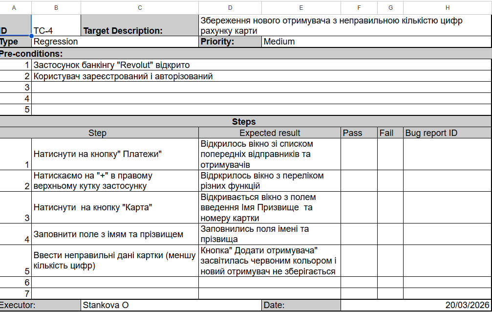
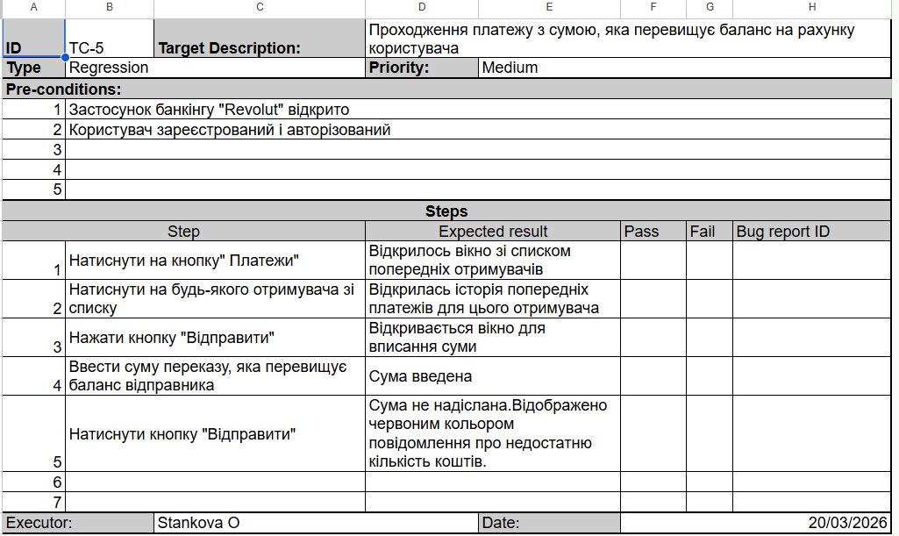
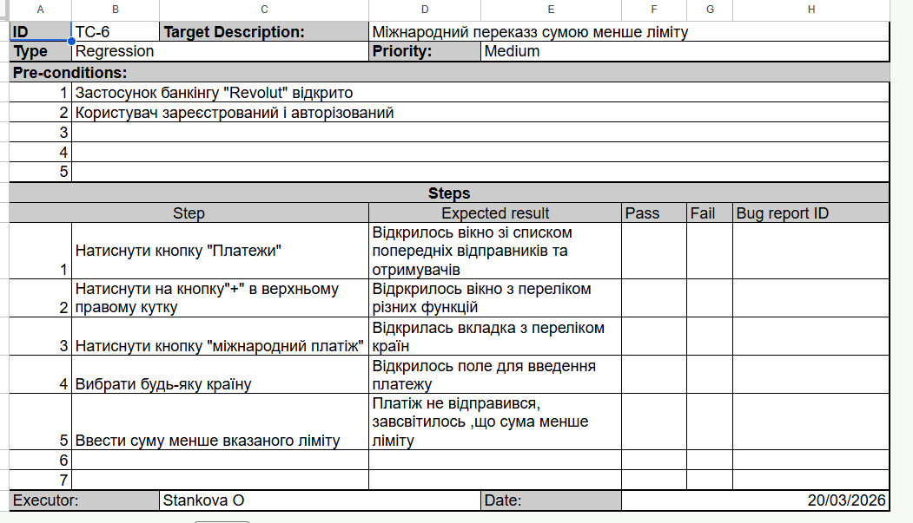
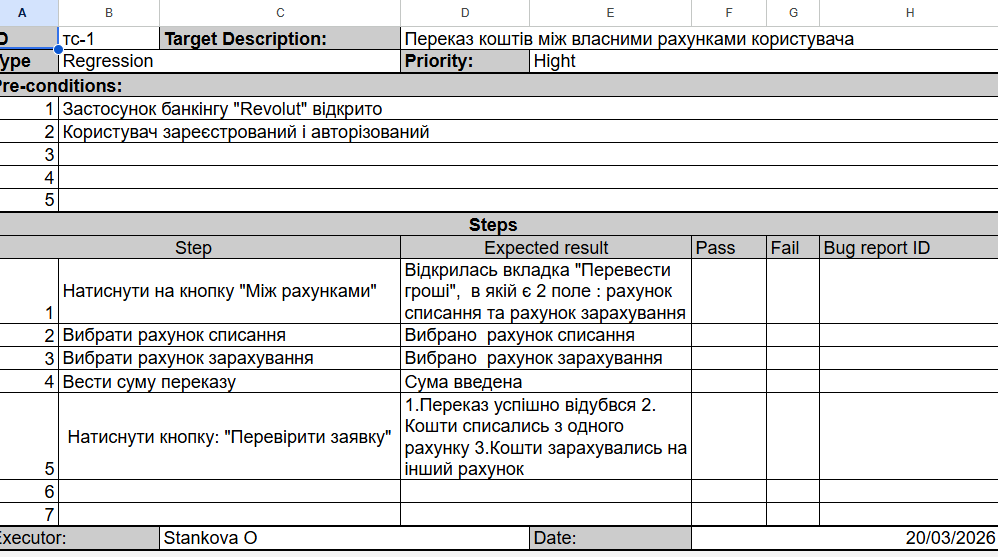
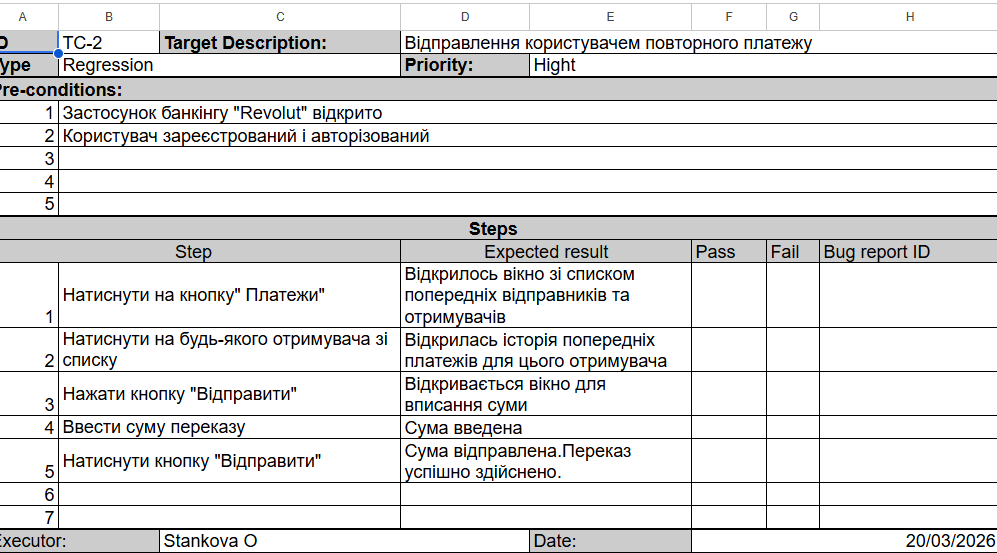
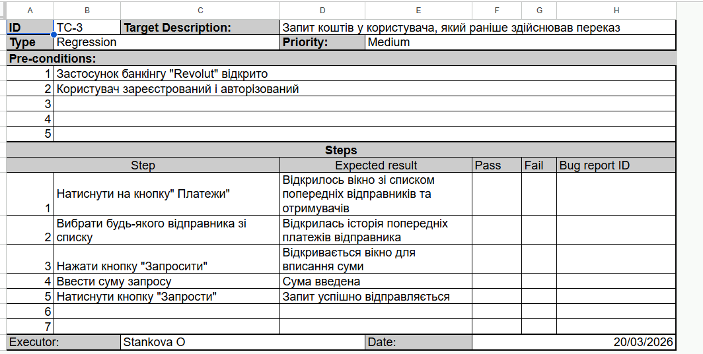

# Test Cases (Ukrainian)

## Тест кейс №1

Збереження нового отримувача з неправильною кількістю цифр рахунку карти

## Тест кейс №2
Проходження платежу з сумою, яка перевищує баланс на рахунку користувача

## Тест кейс №3
Міжнародний переказз сумою менше ліміту

## Тест кейс №4
Переказ коштів між власними рахунками користувача

## Тест кейс №5
Відправлення користувачем повторного платежу

## Тест кейс №6

Запит коштів у користувача, який раніше здійснював переказ

